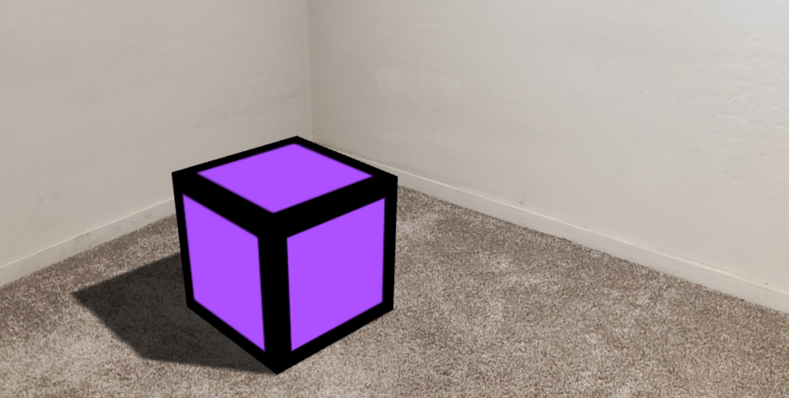

# 8th Wall Magic Portal

This project uses 8th Wall SLAM tracking with three.js to pin a Dr. Strange-inspired magic portal into the real world. Users can place the portal on the ground and walk through it to experience an immersive 3D world.



## Idea Plan

### Vision

Create an AR experience where users can place and interact with a magical portal in their real-world environment.

### Experience Flow

1. **SLAM placement** - 8th Wall world tracking anchors the portal in front of the user.
2. **Magic portal reveal** - Animated door opens as the user approaches.
3. **Portal entry** - Walking through the portal threshold transports the user into a 3D world.

### Milestones

- **MVP 1 - Portal Placement**: Build a SLAM-anchored animated portal with ground placement.
- **MVP 2 - World Entry**: Enable walking through the portal to enter a 3D world.
- **MVP 3 - World Customization**: Add ability to customize the portal world content.
- **MVP 4 - Spatial Interaction**: Add raycasting and hand/tap interactions.

## Current Prototype

- Animated door portal is created in `src/threejs-scene-init.js`.
- The Portal UI is created in `src/app.js` and styled in `src/index.css`.
- Tap the AR canvas to select a ground point and place the portal.
- Walk through the portal threshold with the phone to enter the 3D world.


## Portal Entry Technology Recommendation

For this project, use a **hybrid rendering strategy**:

1. **MVP / broad phone support: 360 image or 360 video skybox.** This is the best first step for a web-based 8th Wall experience because it loads quickly, works on more phones, and makes the “walk through the portal” interaction feel immediate.
2. **Premium location mode: Gaussian splatting / point-cloud-style 3D capture.** Gaussian splats are the better latest-generation technique when you need realistic depth, parallax, reflections, and a stronger sense of physically standing in the place. Use it for hero destinations after performance testing and optimization.
3. **Fallback: lightweight mesh + hotspots.** For slower devices, keep the 360 skybox and add simple 3D hotspot markers rather than forcing a heavy full-scene reconstruction.

### Why not point cloud only?

Traditional point clouds can look sparse on mobile and often need custom shaders, large files, and careful occlusion handling. Gaussian splatting is generally the more modern choice for photoreal reconstructed places, while a 360 skybox remains the safest first implementation for WebAR performance.


## Portal Improvement Brainstorm

- **Auto-fit doorway mode**: keep the new 2x default portal size, then let the app gently resize the portal based on detected floor distance so it feels like a believable human-scale doorway on different devices.
- **Guided placement preview**: show a translucent landing ring before the portal appears, with “too close,” “too far,” and “good spot” feedback to reduce awkward placement.
- **Depth-aware threshold effects**: add a stronger rim glow, wind particles, and audio swell as the camera approaches the entry radius so users understand when walking forward will transition into the destination.
- **Destination-specific portal skins**: vary rune shapes, particle colors, ambient sounds, and pedestal textures for Bagan, Kyoto, and Machu Picchu instead of changing only the inner card color.
- **Agent-led discovery prompts**: after each destination change, surface 2–3 tappable question chips such as “What should I notice first?” or “Teach me a local etiquette tip.”
- **Performance quality tiers**: detect device capability and choose between Gaussian splat, 360 skybox, or hotspot-only mode automatically.

### Walk-through Behavior Implemented

The prototype now detects when the phone camera gets close to the portal. When the user physically walks forward through the portal threshold, the app shows the 3D world content. When the user walks back out, the 3D world hides and the AR portal remains anchored in the real world.

### SLAM + Computer Vision Portal Stability

The portal combines 8th Wall world tracking with a production-oriented tracking confidence guard so visitors can physically walk into the portal without letting a low-confidence pose trigger a bad transition. The app samples camera pose motion over a rolling window, scores motion jitter and speed, debounces tracking-state changes, and exposes stable, recovering, or limited states.

When tracking confidence drops, the portal gives the visitor recovery guidance and blocks entry while tracking is limited. A recenter control lets the visitor place the portal back in front of the camera after relocation or drift.

Production hardening checklist:

- Wire vendor-level 8th Wall tracking-status callbacks into the same `portal-tracking-change` event shape when the deployed workspace exposes them.
- Use image targets, VPS, or cloud/localization anchors for destinations that require repeatable real-world placement.
- Add depth/occlusion where supported so the doorway blends with real geometry.
- Keep 360 or optimized Gaussian splat content as the first inside-portal renderer, then stream heavier assets only after stable tracking is detected.
- Log anonymized tracking-state transitions to analytics so thresholds can be tuned from device-field data.

## Usage

1. Install dependencies: `npm install`
2. Start the dev server: `npm run serve`
3. To connect to a mobile device, follow [8th Wall's testing instructions](https://8th.io/test-on-mobile).
4. Open the experience on a supported mobile browser and allow camera access.


## Supabase ချိတ်ဆက်နည်း

ဒီ prototype မှာ Supabase ကို frontend ကနေ `VITE_SUPABASE_URL` နဲ့ `VITE_SUPABASE_ANON_KEY` သုံးပြီး ချိတ်ထားပါတယ်။ Login/Signup, admin user list, နဲ့ Portal World Editor save/load တွေက `src/app.js` ထဲက Supabase REST helpers တွေနဲ့ အလုပ်လုပ်ပါတယ်။

### 1. Supabase project တစ်ခုဖန်တီးပါ

1. [Supabase](https://supabase.com/) မှာ project အသစ်တစ်ခုဖန်တီးပါ။
2. Dashboard ထဲက **Authentication > Providers > Email** မှာ Email provider ကို enable လုပ်ပါ။
3. **Project Settings > API** ထဲက Project URL နဲ့ anon public key ကို copy လုပ်ပါ။

### 2. Environment variables ထည့်ပါ

`.env.example` ကို `.env.local` အဖြစ် copy လုပ်ပြီး project URL / anon key ထည့်ပါ။

```bash
cp .env.example .env.local
```

`.env.local` ထဲမှာ ဒီလိုထားပါ။

```env
VITE_SUPABASE_URL=https://your-project-ref.supabase.co
VITE_SUPABASE_ANON_KEY=your-public-anon-key
VITE_PORTAL_EDITOR_PIN=portal-admin
```

`VITE_PORTAL_EDITOR_PIN` က frontend admin/editor panel unlock PIN ဖြစ်ပါတယ်။ Production မှာ secret မထားသင့်ပါဘူး၊ real admin actions တွေအတွက် Supabase Edge Function သို့မဟုတ် server backend တစ်ခုနဲ့ကာကွယ်သင့်ပါတယ်။

### 3. Supabase tables/RLS policy ထည့်ပါ

Supabase Dashboard > **SQL Editor** ထဲမှာ `docs/supabase-setup.sql` ထဲက SQL ကို run ပါ။ အဲ့ဒီ SQL က:

- `profiles` table ဖန်တီးပြီး signup user တွေအတွက် profile auto-create လုပ်ပေးပါတယ်။
- `portal_worlds` table ဖန်တီးပြီး Portal World Editor transform config ကို သိမ်းပေးပါတယ်။
- Row Level Security policies တွေထည့်ပြီး logged-in user / editor / admin role အလိုက် read/write ခွင့်သတ်မှတ်ပေးပါတယ်။

### 4. ပထမဆုံး admin user သတ်မှတ်ပါ

App ကနေ Signup လုပ်ပြီးနောက် SQL Editor မှာ ကိုယ့် email ကို admin role ပြောင်းပါ။

```sql
update public.profiles
set role = 'admin'
where email = 'you@example.com';
```

Portal World Editor ကို save/load လုပ်ချင်တဲ့ user တွေကို `editor` role ပေးနိုင်ပါတယ်။

```sql
update public.profiles
set role = 'editor'
where email = 'editor@example.com';
```

### 5. App ကို run ပါ

```bash
npm install
npm run serve
```

Home page မှာ Login/Signup လုပ်ပါ။ Admin panel ကိုဖွင့်ပြီး PIN ထည့်ပါ။ Portal view ထဲမှာ Editor access ကို unlock လုပ်ပြီး **Save backend world** / **Load backend world** ကိုနှိပ်ရင် Supabase `portal_worlds` table နဲ့ ချိတ်ပြီး frontend portal world ကို update လုပ်ပါလိမ့်မယ်။

## Deployment

Create a production build with `npm run build`, which outputs the app to the `dist` folder. Publish the generated files to your preferred static host.

## Notes

This project relies on the [8th Wall Engine](https://www.npmjs.com/package/@8thwall/engine-binary), [XRExtras](https://www.npmjs.com/package/@8thwall/xrextras), and [Landing Page](https://www.npmjs.com/package/@8thwall/landing-page), which are loaded as script tags in `index.html`.
